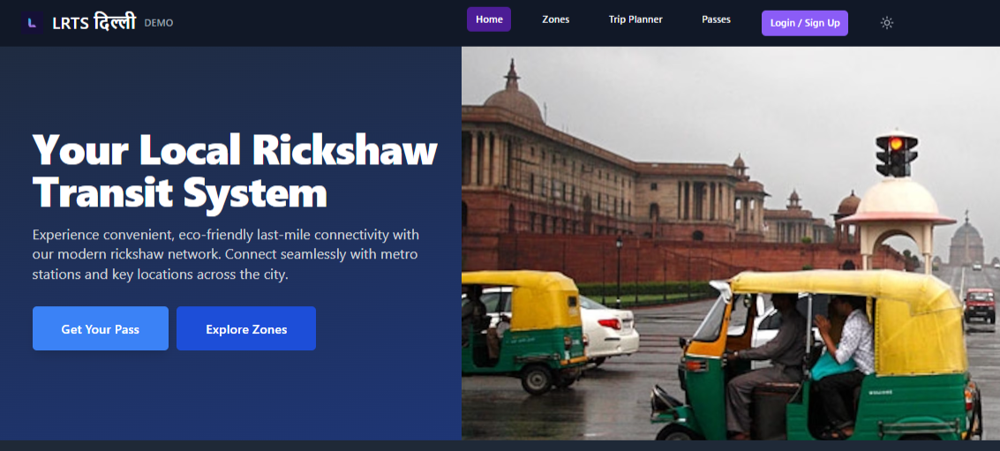
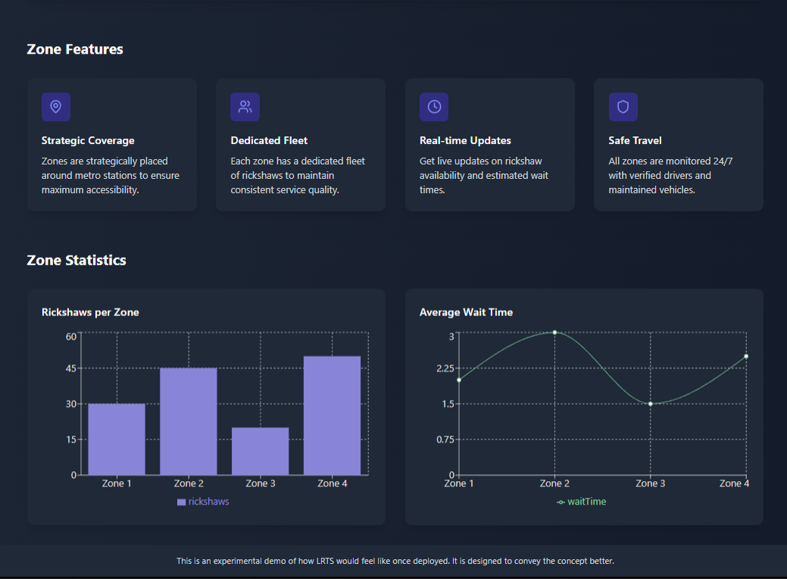
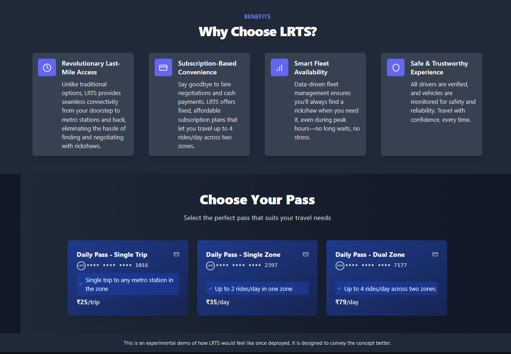

# Lrts-revamped

> built as a demo for our solution first for Toyota Mobility Foundation Sustainable Cities challenge then the final form for Transport Stack Open Innovation Challenge by FITT IIT Delhi

Lrts-revamped is the modernized, production-ready iteration of the Local Rickshaw Transit System (LRTS) concept. It focuses on TypeScript-first architecture, scalable module boundaries, and a polished user experience for last‑mile urban connectivity.

## Screenshots

| Home / Hero | Zones Overview | Zone Analytics | Pass Selection |
|-------------|----------------|----------------|----------------|
|  |  |  |  |

(If the images don't display, ensure the `screenshots/` folder exists at the repository root and the filenames match.)

## Vision

LRTS aims to provide:
- Seamless metro-to-neighborhood last-mile access
- Predictable, subscription-based pricing
- Smart fleet allocation and reduced passenger wait times
- Trustworthy, verified drivers and vehicles

## Key Features

- TypeScript (≈97%) for strong typing and safer refactors
- Modular domain layers: zones, passes, trip planning
- Extensible design for real-time data integration (e.g., availability, wait times)
- Reusable UI component system (buttons, cards, metrics panels)

## Tech Stack

- TypeScript / Modern ES Modules
- (Optional) React / State management (adapt based on actual implementation)
- Tooling: Vite / ESLint / Prettier (adjust if different)
- Small JavaScript utility interop
- Configuration & ancillary scripts (Other)

## Suggested Project Structure

```
src/
  components/
  modules/
    zones/
    passes/
    trips/
  services/
  hooks/
  styles/
public/
screenshots/
```

## Getting Started

```bash
git clone https://github.com/Himanshu762/Lrts-revamped.git
cd Lrts-revamped
npm install        # or pnpm install / yarn
npm run dev        # start dev server
npm run build      # production build
npm run lint       # static analysis
npm test           # if tests configured
```

## Development Conventions

- Prefer explicit types for public function signatures.
- Keep UI components presentational; push business logic into `modules/` or `services/`.
- Use environment variables (e.g. `.env`) for API endpoints if integrating real data.
- Add meaningful unit tests for pricing, zone logic, and time calculations.

## Roadmap Ideas

| Milestone | Description |
|----------|-------------|
| Real-time Fleet Data | Integrate live rickshaw availability and wait-time feeds |
| Driver App API | Authentication & route optimization endpoints |
| Dynamic Pricing | Peak/off-peak and zone-linked subscription tiers |
| Accessibility Audit | WCAG compliance pass & improvements |

## Contributing

1. Fork & clone
2. Create a feature branch: `git checkout -b feat/<short-description>`
3. Commit with conventional messages: `feat(zones): add aggregate metrics panel`
4. Open a Pull Request with context and screenshots if UI-related.

## License

Add a LICENSE file (e.g., MIT) to formalize reuse terms.

## Acknowledgements

- Toyota Mobility Foundation Sustainable Cities Challenge (initial demo inspiration)
- FITT IIT Delhi Transport Stack Open Innovation Challenge (final form context)
- Open-source ecosystem & civic mobility initiatives